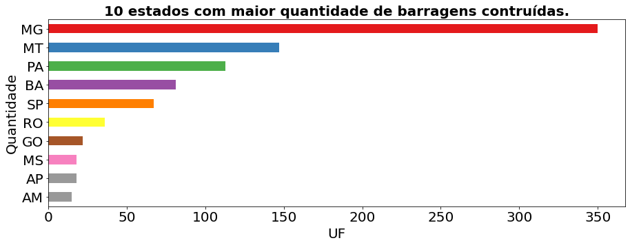
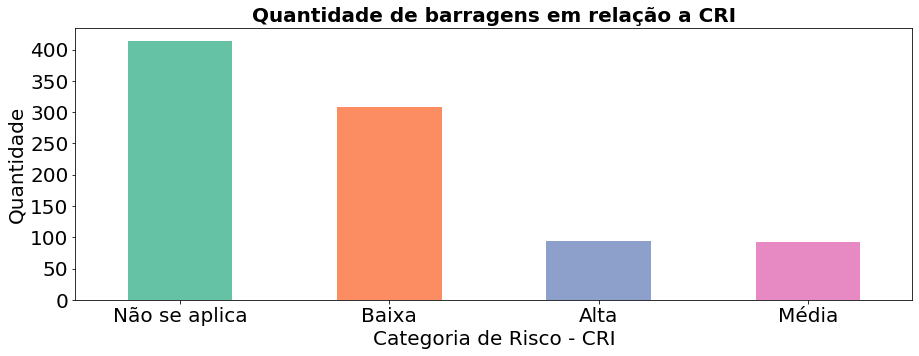
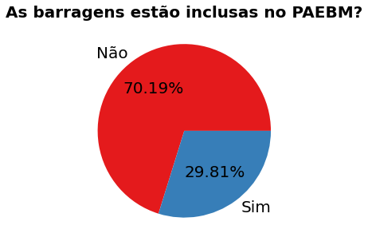
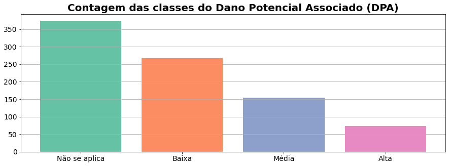
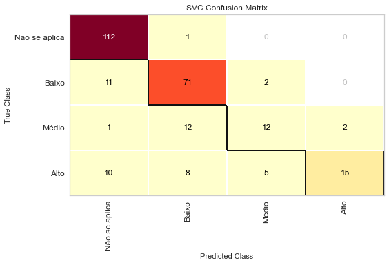
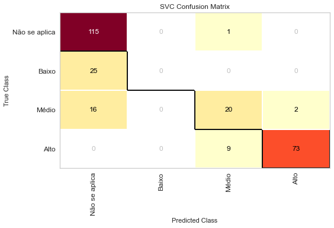

# Análise dos dados sobre barragens de mineração no Brasil

## Sumário

- [Introdução](https://github.com/fernandessfae/barragens_mineracao#introdu%C3%A7%C3%A3o)
- [Análise Geral](https://github.com/fernandessfae/barragens_mineracao#an%C3%A1lise-geral)
    - [Construtores](https://github.com/fernandessfae/barragens_mineracao#construtores) 
    - [Localização](https://github.com/fernandessfae/barragens_mineracao#localiza%C3%A7%C3%A3o)
    - [Categoria de Risco Iminente (CRI)](https://github.com/fernandessfae/barragens_mineracao#categoria-de-risco-iminente-cri)
    - [Dano Potencial Associado](https://github.com/fernandessfae/barragens_mineracao#dano-potencial-associado-dpa)
    - [Plano de Ação de Emergências para Barragens de Mineração (PAEBM)](https://github.com/fernandessfae/barragens_mineracao#plano-de-a%C3%A7%C3%A3o-de-emerg%C3%AAncias-para-barragens-de-minera%C3%A7%C3%A3o-paebm)
    - [Política Nacional de Segurança de Barragens (PNSB)](https://github.com/fernandessfae/barragens_mineracao#pol%C3%ADtica-nacional-de-seguran%C3%A7a-de-barragens-pnsb)
    - [Nível de emergência](https://github.com/fernandessfae/barragens_mineracao#n%C3%ADvel-de-emerg%C3%AAncia)
    - [Minérios presentes](https://github.com/fernandessfae/barragens_mineracao#min%C3%A9rios-presentes)
- [Entendimento do problema](https://github.com/fernandessfae/barragens_mineracao#entendimento-do-problema)
    - [CRI](https://github.com/fernandessfae/barragens_mineracao#cri)
        - [Características Técnicas (CT)](https://github.com/fernandessfae/barragens_mineracao#caracter%C3%ADsticas-t%C3%A9cnicas-ct)
        - [Estado de Conservação (EC)](https://github.com/fernandessfae/barragens_mineracao#estado-de-conserva%C3%A7%C3%A3o-ec)
        - [Plano de Segurança (PS)](https://github.com/fernandessfae/barragens_mineracao#plano-de-seguran%C3%A7a-ps)
    - [DPA](https://github.com/fernandessfae/barragens_mineracao#dpa)
- [Pre processamento](https://github.com/fernandessfae/barragens_mineracao#pre-processamento-dos-dados)
    - [CRI](https://github.com/fernandessfae/barragens_mineracao#cri-1)
    - [DPA](https://github.com/fernandessfae/barragens_mineracao#dpa-1)
- [Visualização da quantidade de dados em relação a classe](https://github.com/fernandessfae/barragens_mineracao#visualiza%C3%A7%C3%A3o-da-quantidade-de-dados-em-rela%C3%A7%C3%A3o-a-classe)
    - [CRI](https://github.com/fernandessfae/barragens_mineracao#cri-2)
    - [DPA](https://github.com/fernandessfae/barragens_mineracao#dpa-2)
- [Criação dos modelos de machine learning](https://github.com/fernandessfae/barragens_mineracao#cria%C3%A7%C3%A3o-dos-modelos-de-machine-learning)
- [Avaliação dos modelos de machine learning](https://github.com/fernandessfae/barragens_mineracao#avalia%C3%A7%C3%A3o-dos-modelos-de-machine-learning)
    - [Acurácia](https://github.com/fernandessfae/barragens_mineracao#acur%C3%A1cia)
        - [CRI](https://github.com/fernandessfae/barragens_mineracao#cri-3)
        - [DPA](https://github.com/fernandessfae/barragens_mineracao#dpa-3)
    - [Matriz de Confusão](https://github.com/fernandessfae/barragens_mineracao#matriz-de-confus%C3%A3o)
        - [CRI](https://github.com/fernandessfae/barragens_mineracao#cri-4)
        - [DPA](https://github.com/fernandessfae/barragens_mineracao#dpa-4)
    - [Precisão](https://github.com/fernandessfae/barragens_mineracao#precis%C3%A3o)
        - [CRI](https://github.com/fernandessfae/barragens_mineracao#cri-5)
        - [DPA](https://github.com/fernandessfae/barragens_mineracao#dpa-5)
    - [Recall](https://github.com/fernandessfae/barragens_mineracao#recall)
        - [CRI](https://github.com/fernandessfae/barragens_mineracao#cri-6)
        - [DPA](https://github.com/fernandessfae/barragens_mineracao#dpa-6)
    - [F1-Score](https://github.com/fernandessfae/barragens_mineracao#f1-score)
        - [CRI](https://github.com/fernandessfae/barragens_mineracao#cri-7)
        - [DPA](https://github.com/fernandessfae/barragens_mineracao#dpa-7)
- [Deploy](https://github.com/fernandessfae/barragens_mineracao#deploy)
- [Conclusão](https://github.com/fernandessfae/barragens_mineracao#conclus%C3%A3o)
- [Referências Bibliográficas](https://github.com/fernandessfae/barragens_mineracao#refer%C3%AAncias-bibliogr%C3%A1ficas)

## Introdução

”Barragens de rejeitos é uma construção que retém as sobras originadas de processos industriais de forma que não contaminem a natureza. Foi inventada no século XIX, pelo engenheiro escocês William John Rankine (1820 – 1872). No Brasil, esse tipo de barragem chegou nos anos 1930, com a aceleração da industrialização. Em 2017, o país possuía 24.000 barragens sendo 790 para contenção de rejeitos de mineração. Dos 3 principais métodos de construção, pelo menos 88 delas foram construídos com o método a montante, como por exemplo Brumadinho e Mariana, o mais barato e mais instável. Hoje existem 19 barragens de rejeitos de minério com alto risco de acidente, 12 delas em Minas Gerais. No mundo existem cerca de 56.000 barragens de rejeitos de mineração. A maior concentração está na China (23.842), Estados Unidos (9.260), Índia (5.100), Japão (3.112) e Brasil (1.400), contudo nem todas as barragens são iguais. As barragens de rejeitos à montante, como Brumadinho e Mariana, não é permitida em qualquer país. Chile e Peru já proibiram esse tipo de barragem, a Austrália está em processo de proibição e o Brasil planeja esse tipo de extinção até 2021. Os acidentes explicam a proibição. Os maiores acidentes por volume de barragem ocorreram nas Filipinas (32,2mi m³, 28mi m³, 13mi m³), Canadá (23,6mi m³) e o maior deles ocorreram em Mariana, no Brasil (60mi m³). Para acidentes contadas pela distância percorrida pelos rejeitos, o ranking muda com Estados Unidos (200km, 200km, 263km), Bolívia (300km), mas o Brasil, com Mariana, ocupa o primeiro lugar (600km). No Brasil, em 2018, a mineração gerou mais de 180.000 empregos diretos e foi o responsável por 4% do PIB nacional. O principal destino do nosso minério de ferro é a China, com 53% das compras, seguido pelo Japão com 8,4%. No Brasil, os maiores estados produtores, praticamente os únicos, são Minas Gerais (67%) e Pará (29,3%). A VALE, fundada por Getúlio Vargas em 1942, é a maior produtora de ferro, pelotas e níquel do mundo. A empresa foi privatizada por Fernando Henrique Cardoso (FHC) em 1997 por 3,3 bilhões de reais e ágio de 20%. No último dia antes da tragédia de Brumadinho (24/01/2019), a empresa valia 296 bilhões de reais. Com a tragédia, a empresa desvalorizou 70 bilhões de reais (223,4 bi)”. 
 

O parágrafo acima é uma transcrição de um vídeo chamado “Para que serve a a perigosa BARRAGEM DE REJEITOS da mineração?”, do canal History Channel, que pode ser acessado <a href=https://www.youtube.com/watch?v=7QKN-JOMlLM>aqui</a>. Ele é uma breve explicação geral sobre as barragens de mineração e também traz um panorama geral das barragens no ano de 2019, no Brasil e no mundo. Só que, no momento em que escrevo esse texto, estamos no ano de 2022, e pode ser que algumas informações contidas no vídeo estejam defasadas, principalmente em relação ao Brasil. Então, será feito um estudo das barragens de mineração aqui no Brasil.
 

## Análise Geral

Então, para fazer uma nova análise das barragens de mineração, utilizou-se os dados do governo federal, especificamente da agência nacional de mineração (ANM), cujo link pode ser acessado por <a href=”https://dados.gov.br/dataset/barragens-de-mineracao”>aqui</a>, ou pode acessar esses dados aqui no repositório. A última atualização desses dados, no momento em que escrevo, foi de 8 setembro de 2021. No Brasil, todas as barragens ,seja mineração ou água, estão sujeitas a lei 12334/10, que trata sobre a segurança das barragens, que pode ser acessado <a href=https://www.planalto.gov.br/ccivil_03/_ato2007-2010/2010/lei/l12334.htm>aqui</a>. É essa lei que trata sobre a política nacional de segurança das barragens (PNSB), cujo intuito é determinar diversos conceitos, parâmetros e obrigações aos empreendedores (donos das barragens) e aos órgãos que fiscalizam a gestão de sua segurança. Depois dessa breve introdução, vamos direto a análise dos dados.
 

### Construtores

Começaremos pelas 10 empresas que mais construíram barragens de mineração em todo o Brasil.
 

Fonte: Arquivo pessoal (2022)
 

Como podemos ver no gráfico, a <b>VALE</b> é a empresa com a maior quantidade de barragens construídas. Vale ressaltar que optou-se por não juntar a Vale matriz com as suas filiais, pelo fato dos CNPJ serem diferentes.
 

### Localização

Agora veremos os estados com a maior localização de barragens de mineração
 

Fonte: Arquivo pessoal (2022)
 

No gráfico dos estados, percebe-se que <b>Minas Gerais</b> possui a maior quantidade de barragens, seguido de <b>Mato Grosso</b> e <b>Pará</b>. O que mais surpreendeu foi o estado do Mato Grosso vir em segundo lugar, já que é uma novidade esse estado ter uma quantidade considerável de barragens. Inclusive, no vídeo do history channel, mencionado acima, os únicos estados mencionados foram Minas Gerais e Pará, mostrando assim que o Mato Grosso pode ser o próximo estado com uma grande relevância na área de mineração. 
 

### **Categoria de Risco Iminente (CRI)**

A categoria de risco corresponde ao somatório de outros 3 fatores (características técnicas, estado de conservação e plano de segurança) da barragem para avaliar o índice de vulnerabilidade. Abaixo veremos o CRI das barragens presentes no Brasil.
 

Fonte: Arquivo pessoal (2022)
 

No gráfico do risco das barragens, percebe-se que grande maioria tem um risco baixo, ou não se aplica. Entretanto, mesmo as barragens com risco médio e alto serem poucas, ainda sim pode causar um baita estrago caso não sejam bem monitoradas. Inclusive, mais a frente iremos ver mais sobre esse tópico.
 

### **Dano Potencial Associado (DPA)**

O dano potencial associado está relacionado aos danos que potencialmente a barragem pode trazer para os elementos localizados a sua jusante, os quais são afetados pela cheia induzida por um eventual rompimento do barramento em cenários distintos de perdas de vidas humanas, impacto ambiental e impacto socioeconômico. Abaixo o gráfico DPA
 

Fonte: Arquivo pessoal (2022)
 

Esse gráfico do DPA é interessante em relação ao CRI, porque mostra que apesar das maioria das barragens não ter um risco ou ter um risco baixo, na hipótese delas sofrerem algum rompimento, o dano dela em relação ao meio ambiente próximo pode ser potencialmente alto. Mais a frente iremos falar mais sobre esse tópico.
 

### Plano de Ação de Emergências para Barragens de Mineração (PAEBM)

<blockquote>O Plano de Ação de Emergência para Barragens de Mineração (PAEBM) é um documento obrigatório por lei para toda atividade que possui barragem, mesmo que não esteja mais em operação. É um documento técnico e de fácil entendimento elaborado pelo empreendedor, no
qual estão identificados os potenciais cenários de emergências da barragem, estabelecidas as ações a serem executadas nesses casos e definidos os agentes a serem notificados, com o objetivo de minimizar danos e perdas de vidas (Portaria ANM 70.389/2017). O PAEBM é um plano preparatório para emergências e visa ações claras e organizadas para proteger e auxiliar a população próxima à barragem. A partir de simulações feitas com programas de computador específicos, o plano apresenta também quais as áreas seriam atingidas caso ocorresse um rompimento de barragens e quais órgãos públicos deveriam atuar. O PAEBM indica ainda as rotas de fuga e os pontos de encontro situados em locais seguros.</blockquote>
 

Acima foi uma breve descrição do que seria o PAEBM. Então sem mais delongas, vamos ver o gráfico.
 

Fonte: Arquivo pessoal (2022)
 

Observando o gráfico, cerca de 70,19% da barragens não precisam do PAEBM, enquanto 29,81% precisam. Tudo levando a crer que essas barragens tem um CRI e/ou DPA não aplicado ou abaixo.
 

### Política Nacional de Segurança de Barragens (PNSB)

A PNSB é uma lei para as barragens de mineração que tem algum nível considerável de periculosidade, seja por causa do tamanho ou resíduo acumulado. Abaixo o gráfico com as barragens com/sem PNSB
 

Fonte: Arquivo pessoal (2022)
 

Observando o gráfico, percebe-se que 54,46% das barragens estão inclusas no PNSB, enquanto 45,54% não. Isso mostra que a maioria das barragens seguem todos os parâmetros exigidos por lei para determinar o seu funcionamento.

### Nível de emergência

O nível de emergência é um indicador que indica um possível rompimento da barragem. Quanto maior o nível, maior a possibilidade de rompimento. Abaixo o gráfico do nível de emergência
 

Fonte: Arquivo pessoal (2022)
 

Como podemos perceber no gráfico, esmagadora maioria das barragens estão sem ou baixo nível de emergência. O que é um ótimo sinal, mostrando que a maioria das barragens estão com o seu monitoramento em dia.
 

### Minérios presentes

Como a barragem de minério é resulltado final de um processo industrial, é sempre bom saber quais tipos de minério estão presentes nessas barragens. Abaixo está o gráfico com os 10 maiores minérios presentes nas barragens.
 

Fonte: Arquivo pessoal (2022)
 

Vemos que a maioria das barragens não tem esse tipo de minério, mas, tirando essa opção, vemos que o <b>ferro</b>, <b>ouro</b> e <b>cobre</b> são as 3 primeiras opções nas  composições de barragens de minérios.
 

Como podemos perceber através dos gráficos, as informações de destaque são as seguintes: Grande parte das barragens foram construídas pela VALE e suas filiais, a localização da maioria das barragens ficam em Minas Gerais, a maioria das barragens tem a categoria de risco baixa ou inexistente, porém em relação ao DPA, uma grande parte não existe, mas há uma boa parte com o DPA alto, a maioria das barragens não necessitam do PAEBM, das mesma forma que grande parte das barragens não se enquadram no PNSB, a grande maioria também estão sem algum tipo de nível de emergência e os resíduos presentes nessas barragens não foram informados ou não possuem.
 

Como deu para perceber, isso foi apenas um panorama geral com as informações que eu achei mais relevantes a primeiro momento. Mas é possível extrair mais informações com essa base de dados, que já foi disponibilizada via link do site do governo federal e/ou estará presente no repositório. Logo mais adiante, iremos ver uma forma mais interessante de fazer a classificação de futuras barragens.
 

## Entendimento do problema

Podemos ver que o monitoramento de barragens é algo de suma importância, mas teria como identificar aquelas barragens com um alto potencial de risco e dano? Bom, agora podemos dizer que sim, é possível, mas como? Então, é ai que entra a tecnologia, mais especificamente os algoritmos de machine learning e a inteligência artificial, afinal são elas que resolvem esse tipo de problema, e muitos outros. Entretanto, antes de fazer os algoritmos, é necessário entender o problema, para a partir daí preparar uma solução robusta. Então, vamos lá. 
 

Para entender como classificar futuras construções de barragens de minério, é necessário entender a sua classificação, e para isso optei por acessar esse <a href=https://www.geoscan.com.br/blog/classificacao-de-barragens/>site</a>, que fala mais sobre a classificação das barragem, que, mesmo de diferindo um pouco das barragens de rejeitos de minérios, já serve como parâmetro para entendimento do problema. Resumidamente, os fatores mais importantes para classificação das barragens são: categoria de risco da barragem (CRI) e o dano potencial da barragem (DPA), que serão comentados logo mais abaixo.
 

### CRI

 A classificação da categoria de risco (CRI) é feita em função das características técnicas (CT), do estado de conservação e o plano de segurança (PS) da barragem. Cada um deles serão explicados logo mais abaixo.
 

#### Características Técnicas (CT)

As características técnicas são refentes aos itens abaixo:   

- Altura  
- Comprimento  
- Material de construção  
- Tipo de fundação  
- Idade  
- Vazão do projeto  

Onde cada item tem um valor para cada tipo de situação e então é atribuído uma pontuação com seu respectivo peso. Então a característica técnica de uma barragem é o somatório da pontuação de todos os itens. Esses itens estão disponíveis na base de dados oferecidas pelo governo, cujo link está <a href=https://dados.gov.br/dataset/barragens-de-mineracao>aqui</a>, ou também disponível no repositório do projeto. 

 

#### Estado de Conservação (EC)

O estado de conservação de barragens refere-se ao modo de funcionamento da barragem, como:   

- Confiabilidade das estruturas extravasoras 
- **Confiabilidade das estruturas de adução** 
- Percolação 
- Deformações e recalques 
- Deterioração dos taludes / parâmetros 
- **Eclusa** 

Cada item refere-se a um aspecto do funcionamento da barragem, e o somatório total dos itens representam o estado de conservação. Os itens em negrito indicam que estão em falta na base de dados original, entretanto isso não impossibilita de continuar com o estudo geral da barragem, já que serve para dar um norte na questão da categoria de risco (CRI).

 

#### Plano de Segurança (PS)

O plano de segurança é, como o nome já diz, uma série de itens necessários para definir o quão seguro uma barragem está, como:  

- Existência de documentação do projeto 
- Estrutura organizacional e qualificação técnica dos profissionais da equipe de segurança de barragem 
- Procedimentos de roteiros de inspeções de segurança e de monitoramento 
- Regra operacional dos dispositivos de descarga da barragem 
- **Relatórios de inspeção de segurança com análise e interpretação** 

Assim como no tópico anterior, o item em negrito também não está presente na base de dados, todavia isso também não interfere no estudo geral da barragem para a futura classificação de risco (CRI).
 

No final, o resultado da classificação CRI são divididos em: ‘Não se aplica’, ‘Baixa’, ‘Média’, ‘Alta’.
 

### DPA

O dano potencial associado (DPA) é calculo em função do:  

- Volume total do reservatório 
- Potencial para a perda de vidas humanas 
- Impacto ambiental 
- Impacto socioeconômico 

Apesar de ter apenas uma categoria e menos itens do que o CRI, o DPA tem uma relevância um pouco mais elevada. Após o entendimento de cada categoria, vamos entrar mais a fundo sobre esses dados.
 

No final, o resultado da classificação DPA são divididos em: ‘Não se aplica’, ‘Baixa’, ‘Média’, ‘Alta’.
 

## Pre-processamento dos dados

Já o problema foi identificado, juntamente com a a sua possível solução, agora cabe entender os tipos de dados referente a classificação das barragens e fazer o seu devido tratamento. Algo que veremos logo a baixo.
 

### CRI

Pegou-se os dados gerais e separou o CRI e todos os itens que o classificam (CT, EC, PS e seus subitens). Então a partir dessa separação, verificou-se alguns dados tinham valores faltantes em todos os itens para fazer a classificação. Criou-se um código para remover as linhas com os itens faltantes e depois converteu os dados de cada item e subitem específico para números que, inclusive, está na forma para fazer o cálculo da categoria de risco da barragem.

### DPA

Pegou-se os dados gerais e separou o DPA e todos os itens que o classificam (Volume total do reservatório, Potencial para a perda de vidas humanas, Impacto ambiental e socioeconômico). Então após essa separação, observou-se que alguns dados tinham valores faltantes em todos os itens para fazer a sua classificação. Criou-se um código para remover essa linhas com os itens faltantes e depois converteu os dados de cada item específico para números que, inclusive, já está na forma para fazer o cálculo do dano potencial associado.
 

## Visualização da quantidade de dados em relação a classe

Após a etapa de processamento, os dados estão prontos para criação dos algoritmos de machine learning. Entretanto, é sempre bom ver como estão divididos os dados em suas respectivas classes.
 

### CRI

Fonte: Arquivo pessoal (2022)
 

### DPA

Fonte: Arquivo pessoal (2022)
 

Como podemos ver em ambas as classes, há um claro desbalanceamento de dados, com destaque para a classe ‘Não se aplica’, e isso é de suma importância na hora de escolher o melhor algoritmo para cada base de dados, afinal, existem algoritmos que não funcionam bem com dados desbalanceados, sendo necessário a aplicação de técnicas para correção do desbalanceamento, como <b>undersampling</b> ou <b>oversampling</b> (ambas as técnicas não serão utilizadas aqui). Entretanto, há outros algoritmos que sabem contornar o problema do desbalanceamento dos dados, então os dados serão utilizados da forma que vieram.

## Criação dos modelos de machine learning

O criação dos modelos é uma das etapas mais simples e complexas ao mesmo tempo. Simples porque é bem direto de como montar esses modelos, porém complexos porque, para um profissional mais experiente, o desafio é ajustar os parâmetros do(s) modelo(s) para que seja o mais performático possível e evitar possíveis interferências e vieses. Nesse caso, utilizou-se os parâmetros padrões de cada modelo de machine learning, com o intuito de verificar a precisão de cada modelo, sem nenhuma alteração. Abaixo estarão listados alguns dos modelos de machine learning utilizados para a classificação do CRI e DPA.
 

- Naive Bays 
- Decision Tree 
- KNN (K Nearest Neighbors) 
- SVM (Support Vector Machine) 
- Random Forest 

Existem vários outros modelos de machine learning, mas esses citados anteriormente já sejam suficientes para fazer a classificação do CRI e DPA, como veremos abaixo.
 

Para todos os modelos acima, os dados foram separados em treinamento e teste, também conhecido como holdout, para treinar os modelos citados anteriormente, tanto para o CRI quanto DPA. Cada modelo para CRI e DPA foram criado de maneira separada, por questão de organização. Após os modelos criados, vamos ver a precisão de cada um deles.
 

## Avaliação dos modelos de machine learning

Após a criação dos modelos, seja dividindo os dados para treinamento e teste ou fazendo uma validação cruzada, é necessário métricas para avaliar o quão bom um modelo de classificação está, antes de disponibilizá-lo para o público. Então abaixo veremos algumas delas

### Acurácia

Acurácia é a métrica mais simples de ser entendida. Isso porque ela representa o quanto de dados um modelo acertou em relação ao total de dados disponibilizado. Abaixo veremos os gráficos de precisão para classificação do CRI e DPA.
 

#### CRI

Fonte: Arquivo pessoal (2022)
 

#### DPA

Fonte: Arquivo pessoal (2022)
 

Podemos perceber que, no geral, em ambos os casos, todos os modelos tem diferença de acurácia bem baixa, exceto o naive bays do DPA. Então quer dizer que quanto maior a precisão do modelo, melhor ele é? Não exatamente. Isso porque a acurácia não é preciso quanto os dados são desbalanceado (o que acontece nos dados de classificação do CRI e DPA), sendo necessárias outras métricas para avaliar o desempenho dos modelos, que veremos adiante.
 

### Matriz de confusão

A acurácia também pode ser representada pela matriz de confusão. Esta é a representação daquilo que o modelo de machine learning previu comparado com o valor real de cada classe dos dados, em forma de gráfico. Abaixo veremos um exemplo da matriz de confusão do modelo SVM. As matrizes de confusão de outros modelos serão disponibilizados nesse repositório.
 

#### CRI

Fonte: Arquivo pessoal (2022)
 

#### DPA

Fonte: Arquivo pessoal (2022)
 

### Precisão

A precisão diz respeito à quantidade (proporcional) de identificações positivas feita corretamente. Nesse caso específico, ele informa a proporção de acerto que o modelo fez para cada classe. Os valores vão de 0 (acerto mínimo) até 1(acerto máximo).
 

#### CRI

|Classe\Modelo|Naive Bayes|Decision Tree|KNN|SVM|Random Forest|
|:------:|:------:|:------:|:------:|:------:|:------:|
|Não se aplica|0,80|**0,87**|0,84|0,84|**0,87**|
|Baixa|0,84|0,78|0,76|**0,87**|0,74|
|Média|0,35|0,52|0,47|0,63|**0,75**|
|Alta|0,62|0,54|0,68|**0,88**|0,77|

#### DPA

|Classe\Modelo|Naive Bayes|Decision Tree|KNN|SVM|Random Forest|
|:------:|:------:|:------:|:------:|:------:|:------:|
|Não se aplica|0|**0,76**|0,73|0,74|**0,76**|
|Baixa|**0,14**|0|0|0|0|
|Média|0,65|**0,76**|0,45|0,67|**0,76**|
|Alta|**1**|0,99|0,97|0,97|0,99|

Pegando como por exemplo a classe ‘Alta’ (CRI), o modelo SVM, por exemplo, tem uma precisão de 0.88, significa que caso esse modelo preveja 100 vezes as  barragens de classificação ‘Alta’, ele consegue classificar corretamente 88 vezes as barragens de classificação ‘Alta’.
 

### Recall	

O recall mostra a proporção de positivos encontrados corretamente. Nesse caso específico, ele informar o quanto o modelo conseguiu prever corretamente de cada classe. Os valores vão de 0 (acerto mínimo) até 1(acerto máximo).
 

#### CRI

|Classe\Modelo|Naive Bayes|Decision Tree|KNN|SVM|Random Forest|
|:------:|:------:|:------:|:------:|:------:|:------:|
|Não se aplica|**1**|0,96|**1**|0,99|0,95|
|Baixa|0,49|0,80|0,81|0,85|**0,86**|
|Média|**0,59**|0,52|0,26|0,44|0,56|
|Alta|0,42|0,34|0,39|0,39|**0,45**|

#### DPA

|Classe\Modelo|Naive Bayes|Decision Tree|KNN|SVM|Random Forest|
|:------:|:------:|:------:|:------:|:------:|:------:|
|Não se aplica|0|**0,99**|0,81|**0,99**|**0,99**|
|Baixa|**1**|0|0|0|0|
|Média|0,29|**0,66**|**0,66**|0,53|**0,66**|
|Alta|0,74|**0,91**|**0,91**|0,89|**0,91**|

A título de exemplo, pegando a classe ‘Alta’ (DPA), o modelo Random Forest, por exemplo, tem um recall de 0,91, ou seja, o modelo conseguiu prever corretamente 91% dos dados da classe ‘Alta’.
 

### F1-Score

O F1-Score é a média harmônica entre precisão e recall. O melhor valor possível para o F1-score é 1 e o pior é 0.

#### CRI

|Classe\Modelo|Naive Bayes|Decision Tree|KNN|SVM|Random Forest|
|:------:|:------:|:------:|:------:|:------:|:------:|
|Não se aplica|0,89|0,92|**0,91**|**0,91**|**0,91**|
|Baixa|0,62|0,79|0,78|**0,81**|0,80|
|Média|0,44|0,52|0,33|0,52|**0,64**|
|Alta|0,50|0,42|0,50|0,55|**0,57**|

#### DPA

|Classe\Modelo|Naive Bayes|Decision Tree|KNN|SVM|Random Forest|
|:------:|:------:|:------:|:------:|:------:|:------:|
|Não se aplica|0|**0,86**|0,77|0,85|**0,86**|
|Baixa|**0,24**|0|0|0|0|
|Média|0,40|**0,70**|0,53|0,59|**0,70**|
|Alta|0,85|**0,95**|0,94|0,93|**0,95**|

Depois de verificar todas as métricas necessárias para avaliar corretamente um modelo, vemos que, no geral, o modelo <b>Random Forest</b> foi o que se saiu melhor para a classificação CRI e DPA, utilizando o F1-Score com parâmetro, entretanto isso não significa que não pode escolher apenas um modelo para cada os dois tipos de classificação. Uma observação quanto a classe DPA, é que todos os modelos tiveram dificuldade para prever as classes ‘Não se aplicar’ e ‘Baixa’, isso poderia ser resolvido caso opta-se por  fazer um pré-processamento e colocar todos os dados da classe ‘Não se aplica’ para ‘Baixa’, ou considerar ambos os resultados. Como aqui a prioridade é fazer um modelo que reconheça a classificação ‘Média’ ou ‘Alta’, tanto para CRI quanto DPA, e não está tendo um rigor nesse projeto, podemos seguir adiante com o modelo escolhido.
 

Não pode esquecer que, após escolhido o modelo escolhido, é necessário salvar o algoritmo para ser utilizado no deploy, que será visto logo a seguir.

## Deploy

Depois de fazer a análise dos dados, definir a resolução do problema e criar o(s) algoritmos necessários, agora chegou-se a parte final do projeto, chamado deploy. Este é, nada mais nada menos, que colocar o modelo em produção e disponibilizar para o cliente final. É nessa etapa que alguns aspectos do código são corrigidos, aperfeiçoados ou eliminados. É um teste de qualidade para que o modelo de classificação esteja bem desenvolvido para o lançamento. Para vermos o resultado final desse projeto, basta acessar esse <a href=https://share.streamlit.io/fernandessfae/barragens_mineracao/streamlit_ml_app.py>link</a> e experimentar fazer a classificação das barragens de rejeito de mineração.
 

## Conclusão

Após esse projeto com várias etapas, ficou evidente que os dados referentes as barragens de mineração em todo o Brasil abre um leque de possibilidades, desde a geração de gráficos para geração de informações importantes, ate a criação de modelos de machine learning para classificar o risco e dano potencial de uma barragem de mineração quaisquer ou até mesmo fazer uma simulação de uma construção de uma futura barragem, mostrando a importância da programação para todos esses fins citados anteriormente. Isso é de suma importância para profissionais que desejam se destacar no mercado de trabalho, neste caso específico, isso é importante, principalmente, para engenheiros civis (estudo de materiais para simulação das barragens de acordo com aquela área) e engenheiros ambientais (estudos de impactos socioeconômico-ambientais daquela área com a ,futura, presença da barragem) . Não foi uma tarefa fácil, já que contou com muitas etapas, mas o resultado é uma satisfação imensa e sensação de dever cumprido. No mais, agradeço a todos que leram toda essa documentação para entender todo o procedimento.

Ah, para o pessoal que trabalha com programação que deseja saber quais bibliotecas eu utilizei, ou até mesmo a quem se interessar,estará no arquivo <a href=https://github.com/fernandessfae/barragens_mineracao/blob/master/requirements.txt>requirements.txt</a>, assim como os outros scripts estarão tudo documentado para um melhor entendimento. Mas, mesmo assim, caso ainda tenha dúvidas, basta entrar em contato com as minhas redes, presente no meu perfil do <a href=https://github.com/fernandessfae>GitHub</a>. Até mais e que Deus o abençoe!

## Referências Bibliográficas

Para que serve a a perigosa BARRAGEM DE REJEITOS da mineração? . [S.I.: History Channel], Publicado pelo canal history channel. Disponível em: https://www.youtube.com/watch?v=7QKN-JOMlLM. Acesso em: 20 mar. 2021
 

BRASIL. Lei n° 12234, de 20 de setembro de 2010. Estabelece a Política Nacional de Segurança de Barragens destinadas à acumulação de água para quaisquer usos, à disposição final ou temporária de rejeitos e à acumulação de resíduos industriais, cria o Sistema Nacional de Informações sobre Segurança de Barragens e altera a redação do art. 35 da Lei no 9.433, de 8 de janeiro de 1997, e do art. 4o da Lei no 9.984, de 17 de julho de 2000. Diário Oficial da República Federativa do Brasil. Brasília, DF.
 

IPÊ, Mineração. Conheça o PAEBM, Plano de emergência para barragens de mineração. Disponível em: https://www.ipemineracao.com.br/media/1221/cartilha_informativa_paebm.pdf. Acesso em 20 de mar. 2022
 

Classificação de Barragens: O que é e como é feita. GEOSCAN. Disponível em: https://www.geoscan.com.br/blog/classificacao-de-barragens/. Acesso em 24 de mar. 2022
 